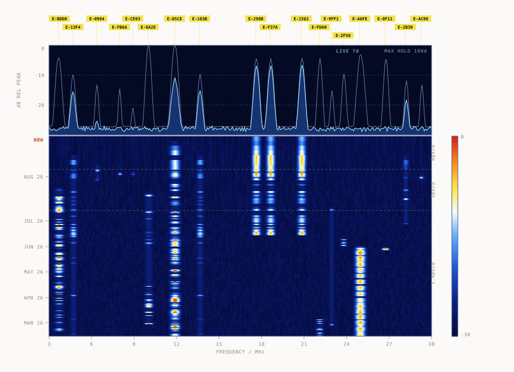

```math
\begin{array}{ccccccccc}
30233 & 21613 & 13552 & 11814 & 05024 & 18146 & 11237 & 89143 & 96678 \\
92808 & 66660 & 42484 & 76242 & 59764 & 18267 & 80152 & 35340 & 92057 \\
52685 & 13804 & 64702 & 63843 & 41255 & 46893 & 06152 & 91086 & 92491 \\
26863 & 27675 & 21090 & 61484 & 70094
\end{array}
```

```math
\small c_i \equiv p_i + k_i \pmod{10} \qquad k = \mathrm{SHA256}(s \,\|\, i) \bmod 10
```

<sub>180 d survey · 2 emitters · regenerated nightly</sub>
