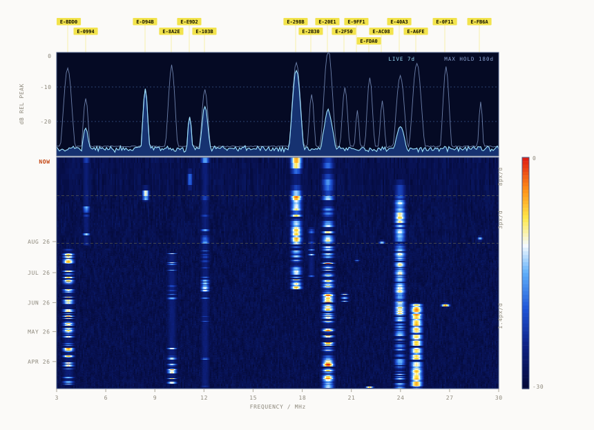

```math
\begin{array}{cccccccccc}
39951 & 97601 & 75805 & 73950 & 29199 & 16245 & 49270 & 21608 & 09770 & 17578 \\
67464 & 27231 & 96628 & 04958 & 76127 & 02323 & 99397 & 98998 & 90098 & 23118 \\
44792 & 77734 & 78332 & 47447 & 67746 & 58067 & 84075 & 58586 & 02058 & 62043 \\
60893 & 31724 & 59792 & 54654 & 11707 & 54061 & 75202 & 97450 & 83545 & 65953 \\
99147 & 60708 & 66047 & 49921
\end{array}
```

```math
\small c_i \equiv p_i + k_i \pmod{10} \qquad k = \mathrm{SHA256}(s \,\|\, i) \bmod 10
```

<sub>180 d survey · 17 emitters · regenerated nightly</sub>
